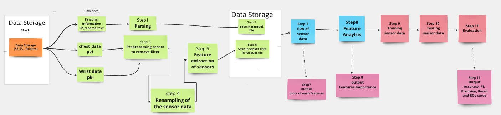

# WESAD (Wearable Stress and Affect Detection)

This project aims to prepare data and further prediction of mood (1: Neutral , 2: Stress, 3: Amusement) using wearable sensors.

## 🚀 Getting Started

Follow these instructions to get the project up and running on your local machine, be it for development or testing.

### 📋 Prerequisites

Ensure you've got the following tools and environments set up:

- **Python 3.x**
- **pip**
- **virtualenv** (highly recommended)

### 📁 downlaod data sample to run the code
- **[Data](https://drive.google.com/drive/folders/17Owq3tHlki4pCuk8EVzGRzj37sR8tkmt?usp=sharing)** 


- **Note: Please download the data sample and then creat a folder with name `raw`  in the `data'`folder of the project structure and then upload S2 folder(sample data) inside it**


### 🔧 Installation & Execution


1. **Clone the repository**:

   ```bash
   git clone https://github.com/pgupta119/wesad
   ```

2. **Set up and activate your virtual environment**:

   ```bash
   virtualenv venv
   source venv/bin/activate
   ```

3. **Install necessary packages**:

   ```bash
   pip install -r requirements.txt
   ```

4. **Execute the main script**:

   ```bash
   python main.py
   ```

   - **Output:** Files will be saved to the `data/processed/` directory.
   - **Generated Files:** Look for `outputs/feaures`, `outputs/plots`, `outputs/model_roc_graph` in the `outputs` directory and `mlruns/` in the `mlruns` directory.

A visual representation of the workflow:

---

## 🚶‍♂️ Step-by-Step Workflow
Refer to the diagram below for a visual representation of the workflow:


---

**Further Reading**: For a deeper dive into the project, consult the [detailed documentation](https://docs.google.com/document/d/1iU6vVZ9tQFq-_YjJeMzF_V0ZJtADZAMvhY57N3kv8CQ/edit?usp=sharing).

## 🛠️ Built With

- **mflow**:  To get the model metrix.

